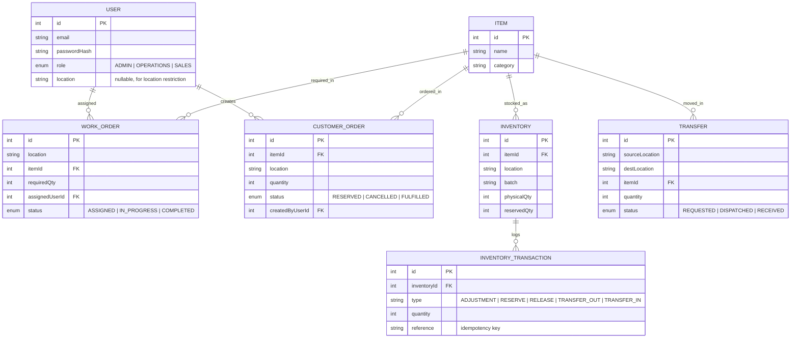

# Database Schema / ER Diagram

This is a real relational schema on PostgreSQL (see `backend/src/db.js`),
with actual foreign keys and `UNIQUE` constraints enforced by the database
itself, not application code. The diagram renders on GitHub as Mermaid:

## Key design decisions

- **`availableQty` is never stored** — it is always computed as
  `physicalQty - reservedQty` at read time, so it can never drift out of sync.
- **One `inventory` row per (item, location, batch)**, enforced by a real
  Postgres `UNIQUE (item_id, location, batch)` constraint — the database
  itself rejects a duplicate stock line, not just application code.
- **Foreign keys are real**: `inventory.item_id`, `work_orders.item_id`,
  `transfers.item_id`, `customer_orders.item_id` and
  `work_orders.assigned_user_id` / `customer_orders.created_by_user_id` all
  reference their parent table with a `REFERENCES` constraint.
- **`inventory_transactions`** is an append-only audit log of every stock
  movement, keyed by an optional `reference` column used as an idempotency
  key (paired with `type` in a `UNIQUE (reference, type)` constraint) to
  guard against duplicate transactions being replayed. Postgres treats
  multiple `NULL` references as distinct, so this constraint only bites when
  a `reference` is actually supplied.
- **Reservation, dispatch, and receive are all done inside a single
  Postgres transaction (`BEGIN` / `COMMIT` / `ROLLBACK`), using conditional
  `UPDATE ... WHERE <headroom still available>` statements.** This turns
  "check, then write" into a single atomic database operation — Postgres
  takes a row lock for the duration of the `UPDATE`, so a second concurrent
  transaction touching the same row blocks until the first commits and then
  re-evaluates the `WHERE` clause against the already-committed values. That
  is what actually prevents two concurrent requests from over-reserving or
  over-transferring stock; a plain read-then-write in application code would
  have a race condition.